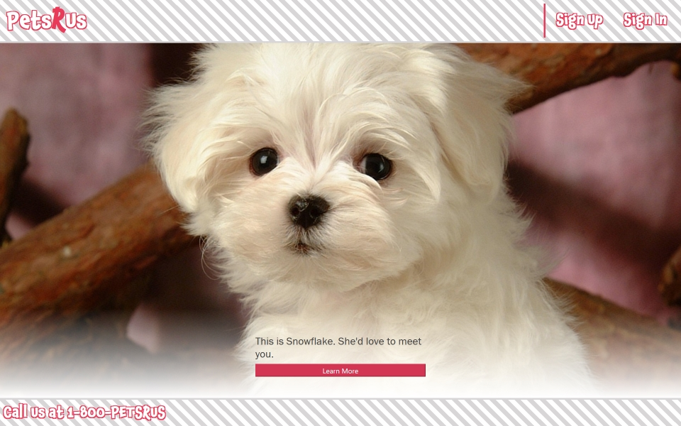
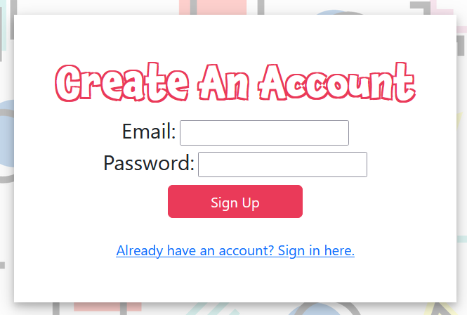
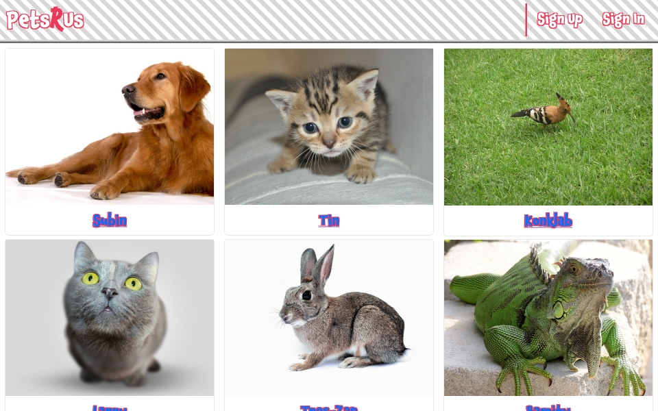

# Pets R Us 
Please visit the [Pets R Us](https://Heroku Link HERE) website.

## Description
Pets R Us is a website where users can view adoptable pets and schedule a vist with the pet.

## Installation
This website works best when using a current version of Firefox or Chrome.

## Usage

When you visit the site you can click on the "read more" button to view the pets that are available for adoption.
 

When you click the "Sign Up" a signup page will appear and you will be able to enter your email and password. Once you have entered your information you can  click on the "Sign Up button to register your account.  You will be prompted with a few questions about your pet preferences. 

## Credits
Special thanks to our contributers:

-Alex, [ag-bootcamp-umn](https://github.com/ag-bootcamp-umn)

-Austin, [AJReis](https://github.com/AJRies)

-Daniel, [dnoon23](https://github.com/dnoon23)

-Jack, [thejackbitt](https://github.com/thejackbitt)

-Kevin, [KDeLaria](https://github.com/KDeLaria)

## License
This application is licensed under the MIT License.  See license document in this repository.